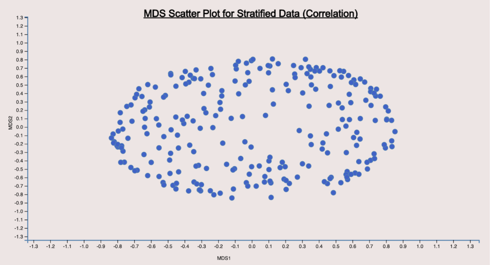
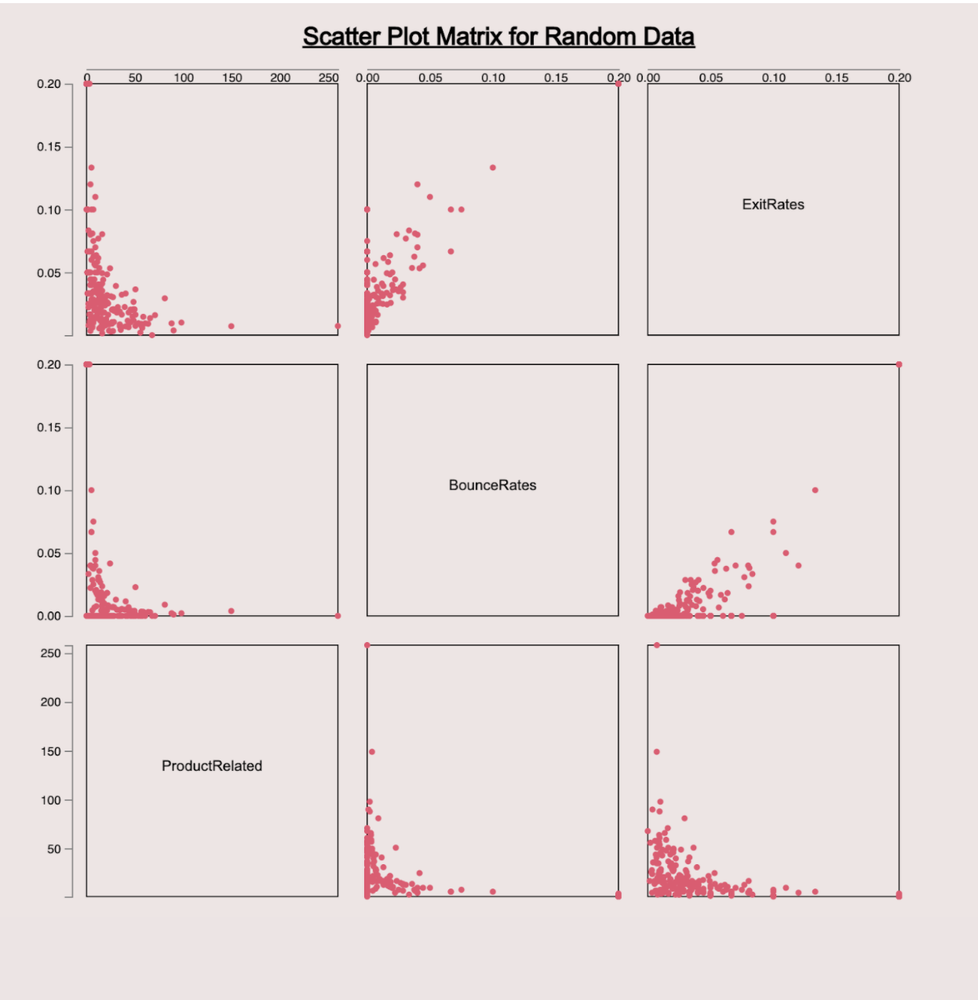

# Visual_Data_Analytics_Basics
Performing basic visual data analysis using Python (Server side) and D3.js(client side)

## Languages and frameworks used
- Languages: 
    - Python
    - Javascript
    - HTML
    - CSS
- Libraries: 
    - Flask (https://pypi.org/project/Flask/)
    - D3.js (https://d3js.org/)

## Clustering of Data
  - Experimentation with two types of sampling: Random and Stratified (k-means with optimized k using elbow method)

## Dimensionality Reduction
  - Comparison of effects of dimensionality reduction on the original and the reduced data samples obtained
  - Performed PCA on the data samples to produce scree plot and to compare them
  - Obtained the intrinsic dimensionality of the data sample
  - Obtained top three attributes with the highest PCA loadings
  - Performed MDS on data samples (using both Euclidean and Correlation distance) to compare them

## Scatterplot Visualisations
  - 2D Scatterplot visualization for top two PCA vectors for all the data samples
  - 2D Scatterplot visualization for the MDS data (Euclidean and Correlation)
  - Scatterplot Matrix visualization for the top three PCA loaded attributes
### Scatterplot: PCA

### Scatterplot: MDS

### Scatterplot: ScatterplotMatrix

### DEMO VIDEO LINK (YouTube): 
https://youtu.be/U9lX7lheJXA
